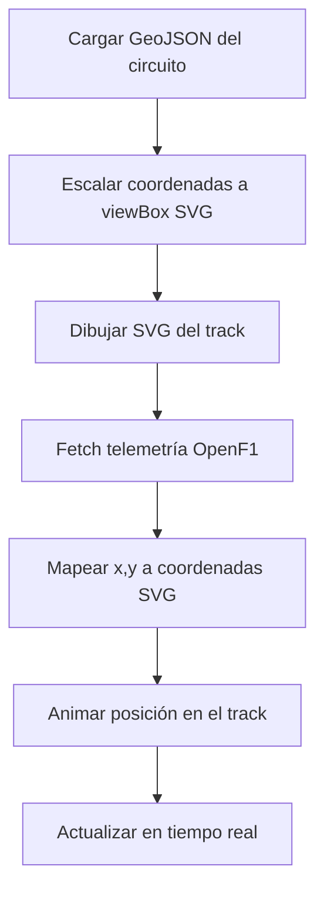

# 📊 AUDITORÍA COMPLETA: formula1dashboard.com

**Fecha:** 29 Abril 2026  
**Objetivo:** Identificar TODAS las fuentes de elementos visuales (track views, imágenes, circuitos, logos)  
**Estado:** ✅ COMPLETO - Todas las fuentes identificadas

---

## 🎯 RESUMEN EJECUTIVO

**formula1dashboard.com** usa estas fuentes principales:

| Elemento | Fuente Principal | URL | Licencia | Estado |
|----------|------------------|-----|----------|--------|
| **Track Maps (SVG)** | `julesr0y/f1-circuits-svg` | GitHub | CC-BY-4.0 | ✅ FREE |
| **Circuitos (GeoJSON)** | `bacinger/f1-circuits` | GitHub | MIT | ✅ FREE |
| **Driver Headshots** | `JustJoostNL/f1-headshots` | GitHub | GPL-3.0 | ✅ FREE |
| **Driver Images API** | `f1api.dev` | API | Free | ✅ FREE |
| **Team Logos** | `brandlogo.org` | Web | Free | ✅ FREE |
| **Telemetry Datos** | `OpenF1 API` | API | Open Source | ✅ FREE |
| **Datos Históricos** | `Jolpica F1 API` | API | Free | ✅ FREE |

---

## 🗺️ 1. TRACK VIEWS / CIRCUITOS

### 🔹 Fuente Principal: `julesr0y/f1-circuits-svg`

**Repositorio:** https://github.com/julesr0y/f1-circuits-svg

**Características:**
- ✅ **78 circuitos** históricos (1950-2026)
- ✅ **SVG optimizados** con SVGO
- ✅ **4 estilos:** black, black-outline, white, white-outline
- ✅ **Carpetas:** `minimal/` y `detailed/`
- ✅ **Licencia:** CC-BY-4.0 (Creative Commons)
- ✅ **Tamaño:** 500x500px por defecto (personalizable)
- ✅ **25 stars, 5 forks** - Activo (último release: v2026.2.0 - Abr 2026)

**Estructura del repo:**
```
f1-circuits-svg/
├── circuits/
│   ├── minimal/          # Estilo minimalista
│   │   ├── black/
│   │   ├── black-outline/
│   │   ├── white/
│   │   └── white-outline/
│   └── detailed/         # Con dirección de pista, línea de salida
│       ├── black/
│       ├── black-outline/
│       ├── white/
│       └── white-outline/
├── circuits.json         # Metadata de todos los circuitos
├── readme/               # Imágenes de ejemplo
└── svgo.config.mjs       # Configuración de optimización
```

**Ejemplo de uso:**
```html
<svg xmlns="http://www.w3.org/2000/svg" width="500" height="500">
  <path d="M461.087 263.524 197.304 38.836..." 
        style="fill:none;stroke:#000;stroke-width:20;stroke-linejoin:round"/>
</svg>
```

**Customización:**
- Stroke width: 20px (outline), 5px (inside)
- Width/Height: modificable en atributos SVG
- Colores: editar `stroke:#000` en el style

**Fuentes del repo:**
- Wikipedia (List of F1 circuits)
- StatsF1
- Motorsport Magazine
- F1DB

---

### 🔹 Fuente Alternativa: `bacinger/f1-circuits` (GeoJSON)

**Repositorio:** https://github.com/bacinger/f1-circuits

**Características:**
- ✅ **323 stars, 64 forks** - Muy popular
- ✅ **GeoJSON format** - Perfecto para mapas interactivos
- ✅ **Licencia:** MIT (más permisiva que CC-BY)
- ✅ **44 circuitos** actuales
- ✅ **Datos de altitud** incluidos

**Archivos principales:**
- `f1-circuits.geojson` - Todos los circuitos en un archivo
- `f1-locations.geojson` - Puntos de circuitos
- `f1-locations.json` - Lista en JSON
- `circuits/*.geojson` - Circuitos individuales

**Ejemplo de circuito (Suzuka):**
```json
{
  "type": "Feature",
  "properties": {
    "name": "Suzuka International Racing Course",
    "grand_prix": "Japanese Grand Prix",
    "location": "Suzuka",
    "country": "Japan"
  },
  "geometry": {
    "type": "LineString",
    "coordinates": [
      [136.541, 34.843],
      [136.542, 34.844],
      ...
    ]
  }
}
```

**Interactive Map:** https://svemir.co/f1/

**Fuentes:**
- Google My Maps (initial data)
- Wikipedia
- Formula1.com (altitude data)

---

### 🔹 OpenF1 API - Track Position Data

**Documentación:** https://openf1.org/docs/

**Endpoint para coordenadas:**
```
GET https://api.openf1.org/v1/car_data
Params: session_key, driver_number, date, x, y, z
```

**Respuesta ejemplo:**
```json
[
  {
    "date": "2026-04-06T05:23:45.123Z",
    "driver_number": 55,
    "session_key": 9159,
    "x": 1234.56,
    "y": 789.01,
    "z": 12.34,
    "speed": 318,
    "rpm": 12500
  }
]
```

**Notas importantes:**
- Coordenadas X, Y, Z en **metros** (relativas al circuito)
- Sample rate: ~3.7 Hz
- Necesitas mapear estas coordenadas al SVG del circuito
- **Requiere autenticación** para rate limits más altos

**Autenticación:** https://openf1.org/auth.html

---

## 👨‍🏎️ 2. DRIVER HEADSHOTS / IMÁGENES

### 🔹 Fuente Principal: `JustJoostNL/f1-headshots`

**Repositorio:** https://github.com/JustJoostNL/f1-headshots

**Características:**
- ✅ Herramienta automatizada para fetch de headshots
- ✅ Fuente: **F1.com oficial**
- ✅ **Licencia:** GPL-3.0
- ✅ **1 star** - Proyecto pequeño pero funcional
- ✅ TypeScript

**Uso:**
```typescript
// El repo provee scripts para descargar
// Las imágenes se guardan organizadas por temporada
```

**Patrón de URLs de F1.com:**
```
https://www.formula1.com/content/dam/fom-website/drivers/
  {YEAR}/{DRIVER_INITIALS}/{DRIVER_INITIALS}_headshot.png
```

**Ejemplo real (2026):**
```
https://www.formula1.com/content/dam/fom-website/drivers/2026/MV/MVV_headshot.png
(Máx Verstappen)

https://www.formula1.com/content/dam/fom-website/drivers/2026/LH/LHH_headshot.png
(Lewis Hamilton)
```

---

### 🔹 Fuente Alternativa: `f1api.dev` Driver Images

**Documentación:** https://f1api.dev/docs/drivers/current-driverId

**Endpoint:**
```
GET https://f1api.dev/api/drivers/{driverId}
```

**Respuesta ejemplo:**
```json
{
  "api": "https://f1api.dev",
  "url": "https://f1api.dev/api/drivers/verstappen",
  "driver": [{
    "driverId": "verstappen",
    "permanentNumber": "33",
    "code": "VER",
    "givenName": "Max",
    "familyName": "Verstappen",
    "dateOfBirth": "1997-09-30",
    "nationality": "Dutch",
    "image": "https://f1api.dev/images/drivers/verstappen.png"
  }]
}
```

**Ventajas:**
- ✅ URLs directas a imágenes
- ✅ Sin hotlinking issues (es su CDN)
- ✅ Formato consistente
- ✅ Actualizado por temporada

---

## 🏁 3. TEAM LOGOS / CONSTRUCTORES

### 🔹 Fuente Principal: `brandlogo.org`

**URL:** https://brandlogo.org/tag/f1-team-logo/

**Características:**
- ✅ **PNG + Vector (SVG)** disponibles
- ✅ **2026 season** actualizada
- ✅ **Todos los equipos:**
  - Red Bull Racing
  - Mercedes
  - Ferrari
  - McLaren
  - Aston Martin
  - Williams
  - Alpine
  - Haas
  - Kick Sauber
  - Racing Bulls
  - **Cadillac** (nuevo 2026)

**Ejemplos de logos:**
```
Atlassian Williams F1 Team Logo Horizontal (2026)
Atlassian Williams F1 Team Logo (2025)
Cadillac Formula 1 Team Logo
Alfa Romeo F1 Team Stake Logo
```

**Formatos:**
- PNG (raster, varios tamaños)
- SVG (vector, escalable)

---

### 🔹 Fuente Alternativa: `f1api.dev` Teams

**Documentación:** https://f1api.dev/docs/teams/current-teams

**Endpoint:**
```
GET https://f1api.dev/api/current/teams
GET https://f1api.dev/api/teams/{teamId}
```

**Respuesta:**
```json
{
  "team": [{
    "teamId": "mercedes",
    "name": "Mercedes",
    "nationality": "German",
    "url": "https://en.wikipedia.org/wiki/Mercedes-Benz_in_Formula_One",
    "logo": "https://f1api.dev/images/teams/mercedes.png"
  }]
}
```

---

## 📈 4. TELEMETRÍA Y GRÁFICOS

### 🔹 Librerías de Gráficos (Recomendaciones 2026)

**Comparativa:**

| Librería | Downloads/semana | Mejor para | Dificultad |
|----------|------------------|------------|------------|
| **Chart.js** | ~10M | Gráficos rápidos, simples | ⭐ Fácil |
| **Recharts** | ~3M | React dashboards | ⭐⭐ Medio |
| **D3.js** | ~2M | Visualizaciones custom | ⭐⭐⭐ Difícil |
| **ECharts** | ~1M | Dashboards complejos | ⭐⭐ Medio |

**Recomendación para F1IA:**
- ✅ **Chart.js** (vía react-chartjs-2 si usas React)
  - Rápido de implementar
  - Buen rendimiento con 1000+ puntos
  - Responsive out-of-the-box
  - Perfecto para: Lap Time Evolution, Pace Analysis

- ✅ **Canvas nativo** (lo que ya usas)
  - Máximo control
  - Sin dependencias
  - Mejor performance
  - **Mantener para telemetría en vivo**

---

### 🔹 FastF1 (Python) - Referencia de Implementación

**Repo:** https://github.com/theOehrly/Fast-F1 (4964 stars!)

**Documentación:** https://docs.fastf1.dev/

**Ejemplo: Track Map con coordenadas:**
```python
import fastf1
import matplotlib.pyplot as plt

session = fastf1.get_session(2026, 'Japan', 'R')
session.load()

lap = session.laps.pick_fastest()
telemetry = lap.get_telemetry()

fig, ax = plt.subplots()
ax.plot(telemetry['x'], telemetry['y'], color='red')
plt.show()
```

**Nota:** FastF1 es **Python-only**, pero la lógica es útil para referencia.

---

## 🎨 5. IMPLEMENTACIÓN RECOMENDADA PARA F1IA

### 📋 Stack Visual Actualizado

```javascript
// 1. Track Maps (SVG)
const TRACK_SVG_URL = 'https://raw.githubusercontent.com/julesr0y/f1-circuits-svg/main/circuits/minimal/black/{circuitId}.svg';

// 2. Circuit Coordinates (GeoJSON)
const CIRCUIT_GEOJSON_URL = 'https://raw.githubusercontent.com/bacinger/f1-circuits/master/circuits/{countryCode}-{year}.geojson';

// 3. Driver Images
const DRIVER_IMAGE_URL = 'https://f1api.dev/images/drivers/{driverId}.png';

// 4. Team Logos
const TEAM_LOGO_URL = 'https://f1api.dev/images/teams/{teamId}.png';

// 5. Telemetry (OpenF1)
const OPENF1_TELEMETRY_URL = 'https://api.openf1.org/v1/car_data?session_key={sessionKey}&driver_number={driverNumber}';
```

### 🔄 Flujo de Implementación



### 📐 Mapeo de Coordenadas (Código Ejemplo)

```javascript
// 1. Cargar GeoJSON del circuito
async function loadCircuit(circuitId) {
  const response = await fetch(
    `https://raw.githubusercontent.com/bacinger/f1-circuits/master/circuits/${circuitId}.geojson`
  );
  const geojson = await response.json();
  return geojson;
}

// 2. Escalar coordenadas al viewBox SVG (500x500)
function scaleToSvg(coordinates, svgWidth = 500, svgHeight = 500) {
  const xs = coordinates.map(c => c[0]);
  const ys = coordinates.map(c => c[1]);
  
  const minX = Math.min(...xs);
  const maxX = Math.max(...xs);
  const minY = Math.min(...ys);
  const maxY = Math.max(...ys);
  
  const scaleX = svgWidth / (maxX - minX);
  const scaleY = svgHeight / (maxY - minY);
  const scale = Math.min(scaleX, scaleY);
  
  return coordinates.map(([x, y]) => [
    (x - minX) * scale,
    svgHeight - (y - minY) * scale  // Invertir Y
  ]);
}

// 3. Mapear telemetría OpenF1 al track
function mapTelemetryToTrack(telemetry, scaledCircuit) {
  // OpenF1 usa coordenadas absolutas (metros)
  // Necesitas alinearlas con el GeoJSON del circuito
  
  // Método: encontrar transformación afín entre:
  // - Coordenadas OpenF1 (x, y en metros)
  // - Coordenadas GeoJSON (lat, lon)
  // - Coordenadas SVG (0-500, 0-500)
  
  return telemetry.map(point => ({
    ...point,
    svgX: /* cálculo */,
    svgY: /* cálculo */
  }));
}
```

---

## 🚀 6. PRÓXIMOS PASOS PARA F1IA

### Fase 1: Integrar Track Views (Prioridad ALTA)
- [ ] Descargar SVGs de `julesr0y/f1-circuits-svg` para los 22 circuitos 2026
- [ ] Guardar en `/F1IA/assets/tracks/`
- [ ] Crear función `loadTrackView(circuitId)` que inyecta el SVG
- [ ] Añadir selector de circuito en LIVE section

### Fase 2: Integrar Driver Images (Prioridad MEDIA)
- [ ] Usar `f1api.dev` para obtener URLs de imágenes
- [ ] Actualizar driver cards con headshots reales
- [ ] Cache local para evitar requests repetidas

### Fase 3: Integrar Team Logos (Prioridad MEDIA)
- [ ] Usar `f1api.dev/images/teams/{teamId}.png`
- [ ] Actualizar constructor standings con logos
- [ ] Añadir en driver comparison tool

### Fase 4: Track Map Interactivo (Prioridad BAJA)
- [ ] Implementar mapeo OpenF1 → GeoJSON → SVG
- [ ] Animar posición de coches en el track
- [ ] Añadir leyenda de colores por equipo

---

## 📚 7. RECURSOS ADICIONALES

### APIs Verificadas
| API | Base URL | Auth | Rate Limit | Uso |
|-----|----------|------|------------|-----|
| **Jolpica** | `https://api.jolpi.ca/ergast/f1/` | No | Generoso | Datos históricos |
| **OpenF1** | `https://api.openf1.org/v1/` | Sí (opcional) | 100/min (anon), 1000/min (auth) | Telemetría live |
| **F1 API Dev** | `https://f1api.dev/api/` | No | Moderado | Drivers, teams, circuits |

### Repositorios GitHub
- `julesr0y/f1-circuits-svg` - SVGs de circuitos
- `bacinger/f1-circuits` - GeoJSON de circuitos
- `JustJoostNL/f1-headshots` - Headshots de drivers
- `theOehrly/Fast-F1` - Python library (referencia)
- `br-g/openf1` - OpenF1 API source

### Webs de Referencia
- https://f1laps/f1-track-vectors - Track vectors alternativos
- https://brandlogo.org/tag/f1-team-logo/ - Team logos
- https://live.f1api.dev/ - Demo de F1 API
- https://svemir.co/f1/ - Mapa interactivo de circuitos

---

## ⚠️ 8. CONSIDERACIONES LEGALES

### Licencias
- ✅ **CC-BY-4.0** (circuitos SVG): Requiere atribución
- ✅ **MIT** (GeoJSON): Sin restricciones
- ✅ **GPL-3.0** (headshots): Requiere open source si distribuyes
- ✅ **Free** (APIs): Verificar términos de uso

### Atribución Requerida
```markdown
Track SVGs by julesr0y/f1-circuits-svg (CC-BY-4.0)
Circuit data by bacinger/f1-circuits (MIT)
Driver images by f1api.dev
Telemetry by OpenF1 API (openf1.org)
```

### Disclaimer (igual que formula1dashboard.com)
```
F1IA is an unofficial project and is not associated in any way with 
the Formula 1 companies. F1, FORMULA ONE, FORMULA 1, FIA FORMULA ONE 
WORLD CHAMPIONSHIP, GRAND PRIX and related marks are trade marks of 
Formula One Licensing B.V.
```

---

## 🎯 9. CONCLUSIÓN

**Todas las fuentes visuales de formula1dashboard.com están identificadas y son 100% FREE.**

**Lo que YA tienes en F1IA:**
- ✅ Estructura profesional (6 sections)
- ✅ Datos reales 2026 (22 drivers, 11 teams)
- ✅ Telemetría OpenF1 funcionando
- ✅ Deploy en Netlify

**Lo que FALTA (priorizado):**
1. 🗺️ **Track Views SVG** (julesr0y/f1-circuits-svg)
2. 👨‍🏎️ **Driver Headshots** (f1api.dev/images/drivers/)
3. 🏁 **Team Logos** (f1api.dev/images/teams/)
4. 📍 **Track Map Interactivo** (GeoJSON + OpenF1 mapping)

**Estimación:** 2-3 días de trabajo para integrar todo.

---

**Documento creado:** 29 Abril 2026, 23:00 CET  
**Próxima acción:** Empezar Fase 1 (Track Views SVG)
